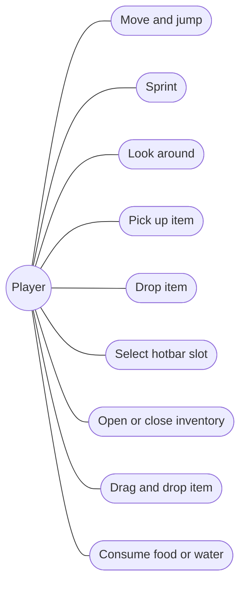
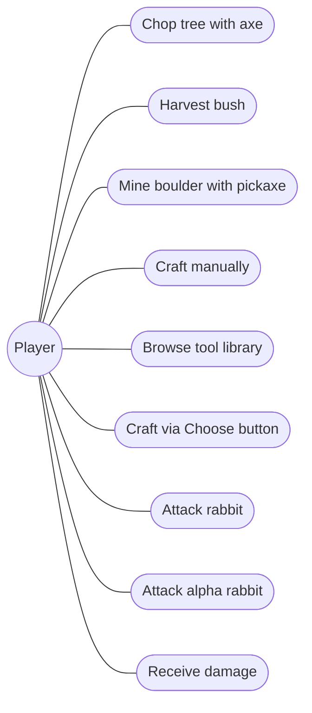
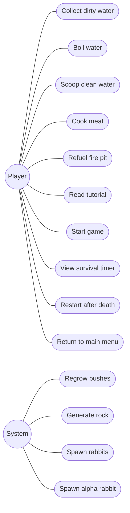
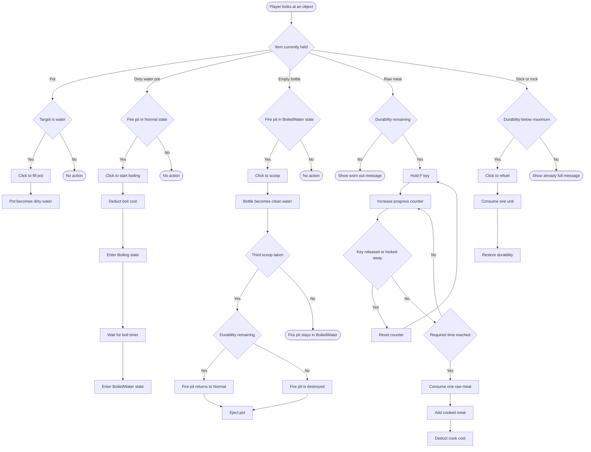
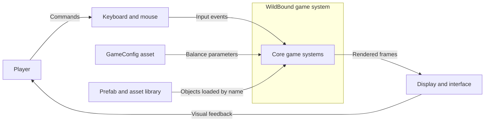
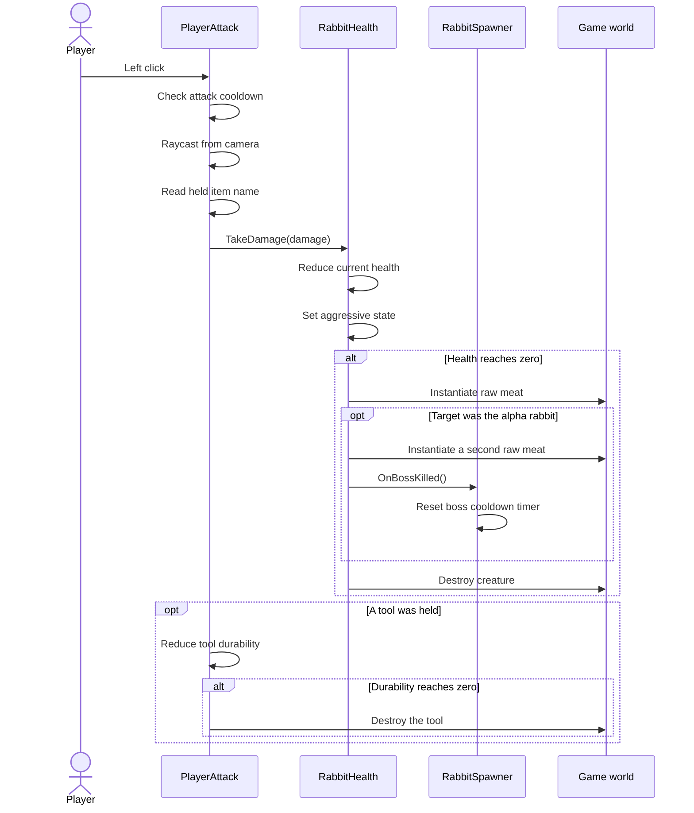
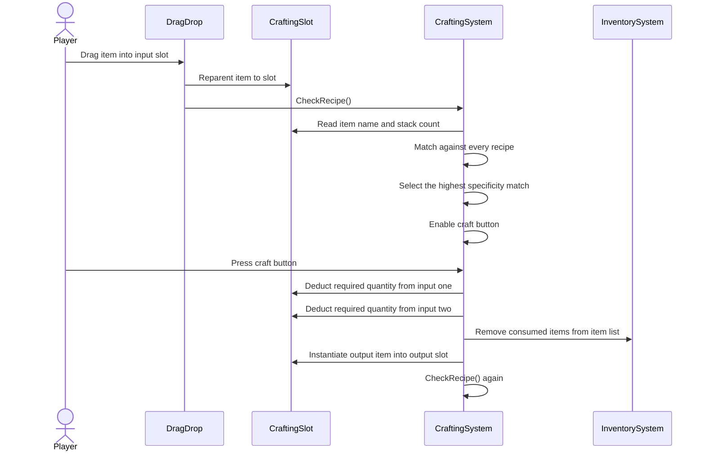
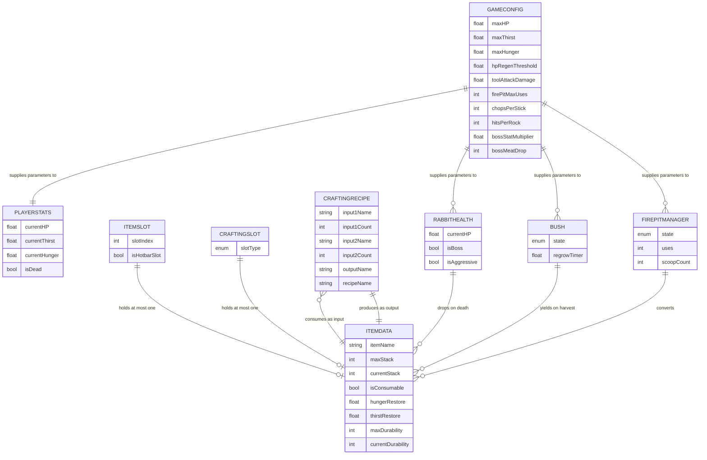
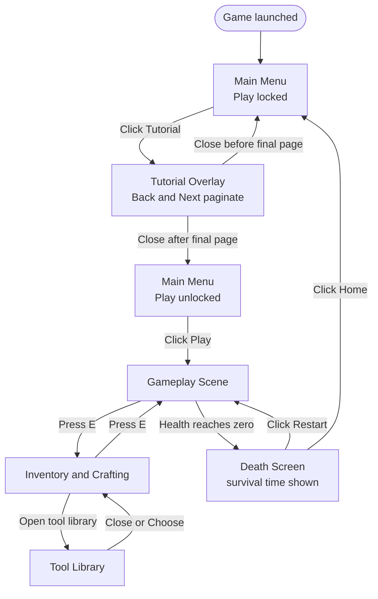

> **⚠️ GHI CHÚ - XÓA KHỐI NÀY TRƯỚC KHI NỘP**
>
> - Ngôi thứ ba, giọng bị động. Không dùng "I", không dùng "the author". Chỉ dùng dấu gạch thường `-`.
> - **Có 9 sơ đồ Mermaid.** Cách render: mở [mermaid.live](https://mermaid.live), dán khối code vào ô bên trái, đổi sang nền sáng bằng icon mặt trăng góc dưới phải, rồi bấm **Actions > PNG** để tải ảnh về. **Không dán code Mermaid vào báo cáo**, chỉ chèn ảnh đã render.
> - Sơ đồ ca sử dụng ở §4.2 được tách làm **ba hình** để vừa khổ trang A4 dọc; nếu gộp lại một hình thì ảnh sẽ kéo ngang và không đọc được.
> - Chương này thêm 1 nguồn mới: **Creepy Jar (2019)**.

---

# CHAPTER 4 - SOFTWARE PRODUCT REQUIREMENTS

## 4.0 Chapter Introduction

This chapter establishes the requirements of the WildBound product. It begins by examining a commercial product within the same genre in order to draw out design lessons, then presents the functional requirements through a use case diagram and user stories, follows with detailed specifications of the most complex use cases accompanied by activity and sequence diagrams, and concludes with the data model and the screen flow diagram.

---

## 4.1 Review of a Comparable Product: Green Hell

### Product Overview

*Green Hell* is a first-person survival game developed by the independent studio Creepy Jar, released in early access in August 2018 and in its complete form in September 2019 (Creepy Jar 2019). The game is set in the Amazon rainforest, where the player controls a character who has become stranded and must sustain themselves.

This product was selected for review because it represents the closest commercial parallel to WildBound: the same first-person perspective, the same setting of an isolated natural environment, the same mechanism of crafting tools from wood and stone, and the same use of survival statistics that decline over time.

### Analysis of the Principal Systems

**The survival statistics system.** Green Hell builds a multi-layered system of statistics. Beyond the basic measures of hunger, thirst and rest, the game maintains four separate nutritional statistics covering protein, carbohydrates, fats and hydration, each of which must be sustained independently. Above these sits a body inspection system, allowing the player to examine parts of the body for wounds, infections, fractures and parasites, and then to treat each condition with the appropriate resource.

**The sanity system.** The most distinctive feature of Green Hell is its sanity statistic, which binds the character's psychological condition to their physical state. Poor nutrition, injuries and prolonged exposure to stressful situations all degrade this statistic, producing hallucinations and changes in the character's behaviour.

**The crafting system.** Sticks, stones, vines and bones are combined into tools and weapons. The noteworthy design point is that recipes are held in a notebook and **are recorded there only once the player has discovered the combination for themselves**, rather than being displayed in full from the outset.

### Comparison With WildBound

| Aspect | Green Hell | WildBound |
|---|---|---|
| Perspective | First person | First person |
| Survival statistics | Hunger, thirst, rest, sanity, plus four separate nutritional measures | Health, hunger, thirst |
| Bodily conditions | Wounds, infections, fractures, parasites | None |
| Crafting recipes | Hidden, recorded once discovered | Displayed in full in the tool library |
| Shelter construction | Present | Absent |
| Narrative | Story mode present | Absent |
| Victory condition | Present in story mode | Absent; survival time is measured instead |

### Lessons Drawn and the Resulting Design Decisions

This review led to three specific decisions for WildBound.

**First, keeping the number of statistics to a minimum.** The seven-statistic system of Green Hell produces considerable depth, but it also requires the player to remember and monitor a great deal of information simultaneously. Within the scope of a final-year project, WildBound retains only three statistics, and invests instead in making those three genuinely interact rather than operate independently - specifically through the conditional health regeneration mechanism that carries a cost, presented in Section 6.3.3.

**Second, displaying recipes rather than hiding them.** This is a point on which WildBound departs from Green Hell deliberately. Green Hell's recipe discovery mechanism rewards the player for finding the correct combination, but it equally creates a risk of impasse where the player cannot guess it. Since WildBound has a small number of recipes and short sessions, hiding them would produce more frustration than interest. The tool library therefore displays every recipe together with its ingredient quantities from the outset.

**Third, omitting shelter construction and narrative.** Both lay beyond what was feasible within the project. Removing them allowed resources to be concentrated on the core loop, consistent with the decision to narrow scope set out in Section 1.2.

---

## 4.2 Use Case Diagram and User Stories

### Actors

WildBound is a single-player game and therefore has only two actors:

- **Player**: the principal actor, performing all interactive actions.
- **System**: the actor representing automatic processes that run over time without player initiation, comprising bush regrowth, rock generation from the boulder, rabbit spawning from burrows, and the cycle governing the appearance of the alpha rabbit.

### Use Case Diagrams

Because WildBound supports a considerable number of distinct actions, the use cases are presented across three diagrams grouped by functional area, rather than compressed into a single figure that would be difficult to read.

📌 **[FIGURE __]** *Use case diagram: movement and inventory management*

📌 **[FIGURE __]** *Use case diagram: resource gathering, crafting and combat*

📌 **[FIGURE __]** *Use case diagram: fire pit interaction, interface and automatic processes*

### User Stories

The principal use cases are restated below as user stories.

| Code | User story |
|---|---|
| US-01 | As a player, I want to collect resources from the map so that I have materials with which to craft tools. |
| US-02 | As a player, I want to see every crafting recipe so that I need neither memorise nor guess them. |
| US-03 | As a player, I want the system to gather ingredients from my inventory when I select a recipe so that I save time on manual handling. |
| US-04 | As a player, I want to craft an axe and a pickaxe so that I can gather resources faster than by hand. |
| US-05 | As a player, I want to boil water before drinking it so that I can restore my thirst safely. |
| US-06 | As a player, I want to cook meat before eating it so that I can restore my hunger. |
| US-07 | As a player, I want to feed surplus sticks and rocks into the fire pit so that I can extend its lifespan. |
| US-08 | As a player, I want to see a creature's health before attacking so that I can decide whether to engage. |
| US-09 | As a player, I want to recognise the alpha rabbit from a distance so that I can prepare for it or avoid it. |
| US-10 | As a player, I want a clear warning when I am losing health so that I can react in time. |
| US-11 | As a player, I want to read the tutorial before playing so that I understand the mechanisms I could not discover unaided. |
| US-12 | As a player, I want to know my survival time so that I can compare it against previous sessions. |
| US-13 | As a player, I want to restart immediately after dying so that I can try again without leaving the game. |

---

## 4.3 Use Case Specifications and Behavioural Diagrams

### 4.3.1 Detailed Use Case Specifications

The four most complex use cases are specified in full below.

#### UC-01: Craft an item

| Field | Content |
|---|---|
| **Actor** | Player |
| **Description** | The player combines two ingredient types according to a recipe in order to produce a new item |
| **Preconditions** | The inventory interface is open; the player holds sufficient quantities of both ingredients |
| **Main flow** | 1. The player drags the first ingredient into the first input slot 2. The player drags the second ingredient into the second input slot 3. The system traverses the recipe list and selects the matching recipe with the highest total ingredient count 4. The system enables the craft button 5. The player presses the craft button 6. The system deducts the required quantity from each input slot 7. The system creates the resulting item in the output slot |
| **Alternative flows** | 3a. No recipe matches: the craft button remains disabled and the flow ends 3b. Ingredients are of the right type but insufficient in quantity: the craft button remains disabled 1a. The ingredients are placed in reverse order: the system still identifies the recipe correctly |
| **Postconditions** | The ingredients are deducted from the inventory; the new item appears in the output slot |

#### UC-02: Boil water

| Field | Content |
|---|---|
| **Actor** | Player |
| **Description** | The player converts dirty water into clean water by means of the fire pit |
| **Preconditions** | The player holds a pot; a water source and a fire pit with remaining durability exist on the map |
| **Main flow** | 1. The player holds the pot and looks at a water source 2. The system displays the interaction prompt 3. The player left-clicks and the pot becomes a pot of dirty water 4. The player holds the pot of dirty water and looks at a fire pit in its Normal state 5. The player left-clicks; the system deducts durability and moves the fire pit into its Boiling state 6. The system counts down the boil timer, then moves the fire pit into its BoiledWater state 7. The player holds an empty bottle and looks at the fire pit 8. The player left-clicks and the empty bottle becomes a bottle of clean water |
| **Alternative flows** | 4a. The fire pit is not in its Normal state: no action is taken 8a. After the third scoop, the fire pit returns to Normal and ejects the pot 8b. If the fire pit's durability is exhausted at that moment, it is destroyed but still ejects the pot |
| **Postconditions** | The player holds a bottle of clean water; the fire pit's durability is reduced |

#### UC-03: Cook meat

| Field | Content |
|---|---|
| **Actor** | Player |
| **Description** | The player converts raw meat into cooked meat at the fire pit |
| **Preconditions** | The player holds raw meat; a fire pit with remaining durability exists |
| **Main flow** | 1. The player holds raw meat and looks at the fire pit 2. The system displays a prompt to hold the F key 3. The player holds the F key 4. The system increments the progress counter and displays progress as a percentage 5. Once the required time is reached, the system consumes one unit of raw meat, adds one unit of cooked meat to the inventory, and deducts durability from the fire pit |
| **Alternative flows** | 3a. The player releases the key or looks away: the counter resets to zero 1a. The fire pit's durability is exhausted: the system displays a worn-out message and does not permit cooking |
| **Postconditions** | Cooked meat is added to the inventory; the fire pit's durability is reduced |

#### UC-04: Attack a creature

| Field | Content |
|---|---|
| **Actor** | Player |
| **Description** | The player attacks a rabbit in order to obtain raw meat |
| **Preconditions** | A creature lies within attack range; the cooldown between attacks has elapsed |
| **Main flow** | 1. The player looks at the creature 2. The player left-clicks 3. The system casts a ray from the camera and identifies the target 4. The system calculates damage according to the tool held and reduces the creature's health 5. The creature enters its aggressive state and begins pursuit 6. When the creature's health reaches zero, the system destroys it and creates raw meat at its position |
| **Alternative flows** | 4a. The player holds an axe or pickaxe: damage is higher and one point of tool durability is deducted 4b. The tool's durability is exhausted: the tool is destroyed and removed from the inventory 1a. The target is the alpha rabbit: it is already aggressive, having detected the player itself 6a. The target is the alpha rabbit: the system creates two units of raw meat and restarts the alpha rabbit spawn cycle |
| **Postconditions** | The creature is destroyed; raw meat appears on the map; tool durability is reduced where a tool was used |

### 4.3.2 Activity Diagram: The Water and Food Processing Chain

The diagram below describes the complete chain of interactions with the fire pit, covering the boiling branch, the cooking branch and the refuelling branch.

📌 **[FIGURE __]** *Activity diagram of the fire pit interaction chain*

### 4.3.3 Context Diagram

The context diagram establishes the boundary of the system and the external entities interacting with it.

📌 **[FIGURE __]** *Context diagram for WildBound*

### 4.3.4 Sequence Diagrams

**First flow: attacking a creature and receiving the resulting drop.** This flow shows the co-operation between four components when the player defeats a creature.

📌 **[FIGURE __]** *Sequence diagram of the creature attack flow*

**Second flow: crafting an item.** This flow shows the process from the player placing ingredients through to the item being produced.

📌 **[FIGURE __]** *Sequence diagram of the crafting flow*

---

## 4.4 Data Model

### Why an Entity Relationship Diagram in the Database Sense Is Not Used

WildBound is an offline single-player game and uses no database. The whole of the game state exists in memory for the duration of a session and is discarded on exit, while configuration data is stored as an engine asset rather than as records in tables.

In place of an entity relationship diagram in the conventional sense, this section therefore presents **a model of the relationships between the game's data entities**. The model still follows the familiar notation of attributes and relationships, but the entities here are data classes held in memory rather than tables in a database.

📌 **[FIGURE __]** *Data model for WildBound*

### Explanation of the Principal Relationships

`GAMECONFIG` is the central entity as regards configuration: it supplies parameters to every entity whose behaviour depends on balance figures, yet is not itself modified by any of them. This is a direct expression of the data-driven design principle.

`ITEMSLOT` and `CRAFTINGSLOT` stand in a **zero-or-one** relationship to `ITEMDATA`: each slot holds at most one item. It should be noted that item quantity is represented not by multiple records but by the `currentStack` attribute on `ITEMDATA` itself, which is why a slot links to at most one entity.

`CRAFTINGRECIPE` relates to `ITEMDATA` in two distinct roles: two ingredient types as input and one type as output. This linkage is established not by a foreign key but by **string name matching**, in keeping with the engine's mechanism for loading assets by name.

---

## 4.5 Screen Flow Diagram

Since WildBound is a standalone application rather than a website, the notion of a sitemap is replaced here by a screen flow diagram describing the interface states and the paths by which the player moves between them.

📌 **[FIGURE __]** *Screen flow diagram for WildBound*

### Explanation

The diagram highlights two points of interest concerning the design of the flow.

First, **the tutorial overlay is not a separate scene** but an interface layer drawn above the main menu. The background camera continues to operate behind it, and moving between the two requires no scene load.

Second, **the Play button remains locked until the player has read the tutorial through**, and this state is reset each time the main menu scene is loaded. This means that a player returning to the main menu from the death screen encounters the locked state once again.

---

# REFERENCES - CHAPTER 4

Creepy Jar (2019) *Green Hell* [computer game], Creepy Jar, Warsaw.
