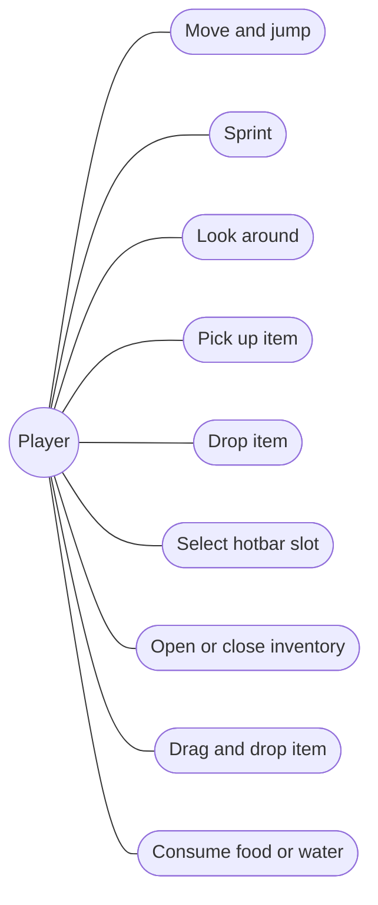
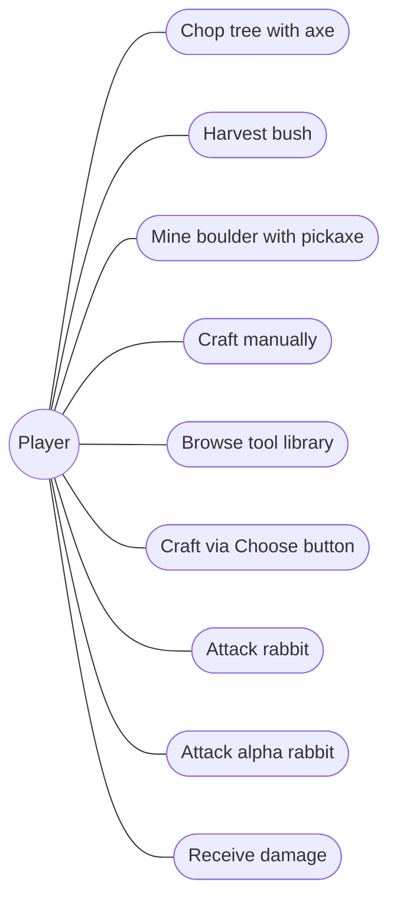
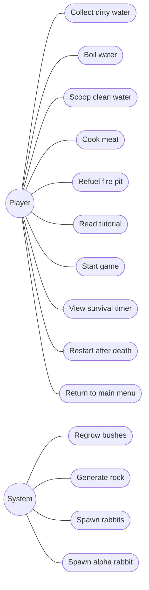
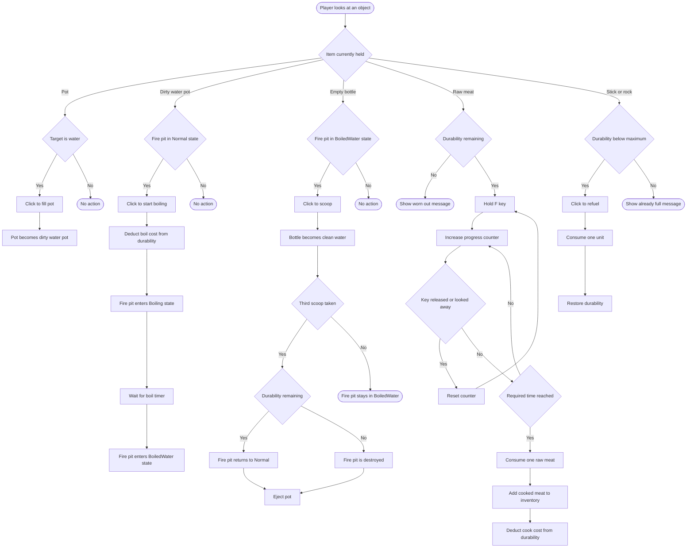
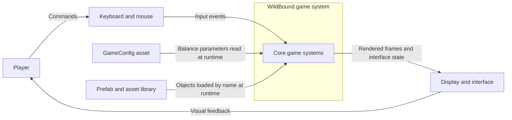
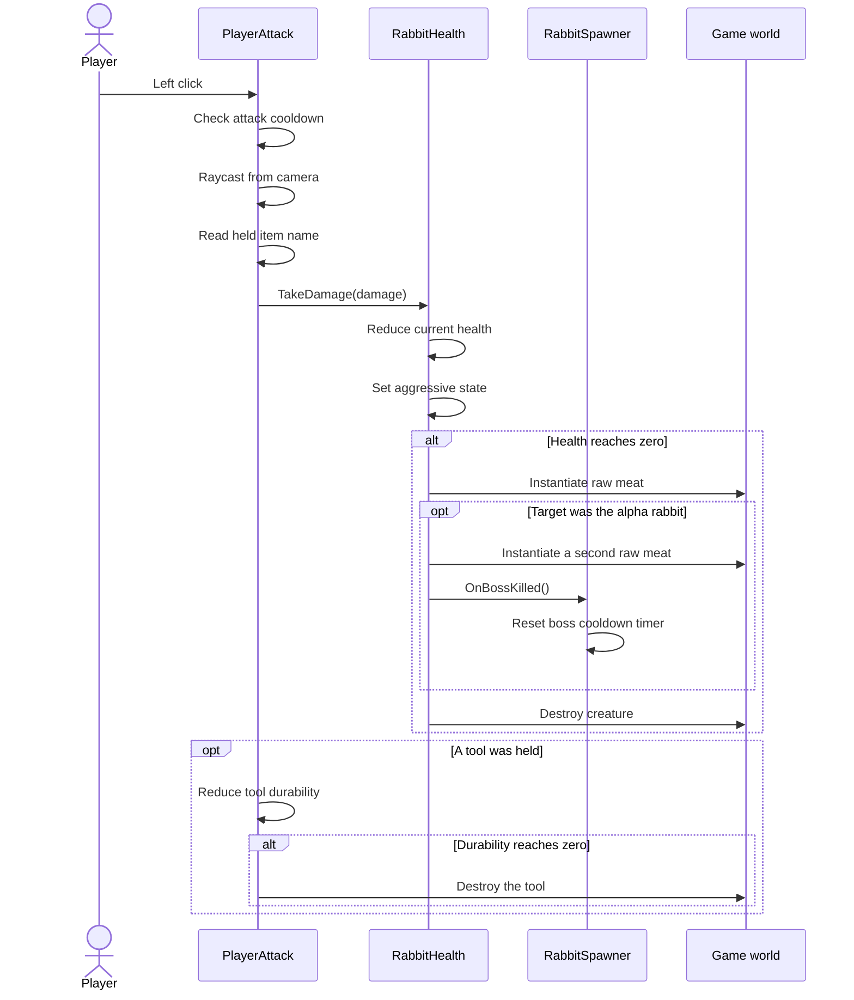
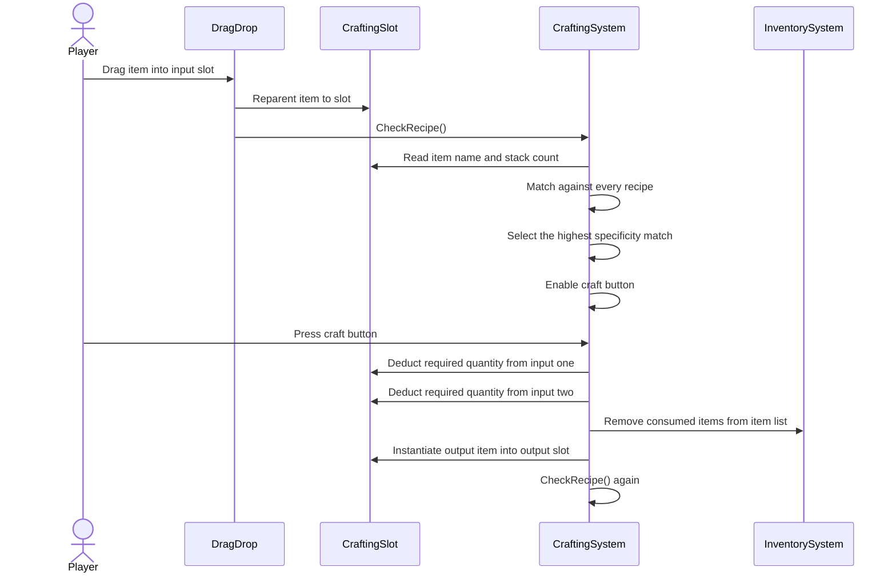
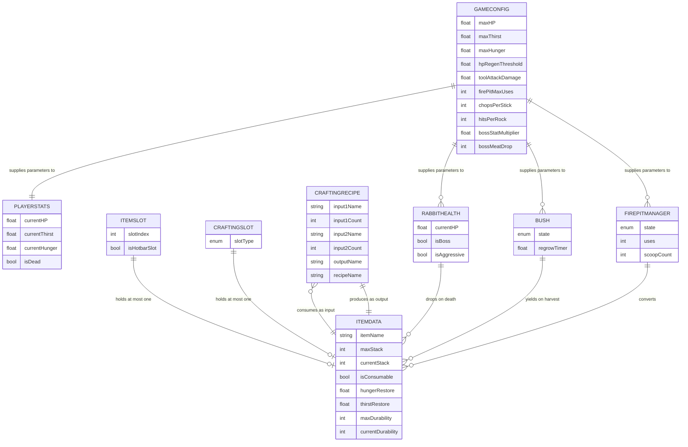
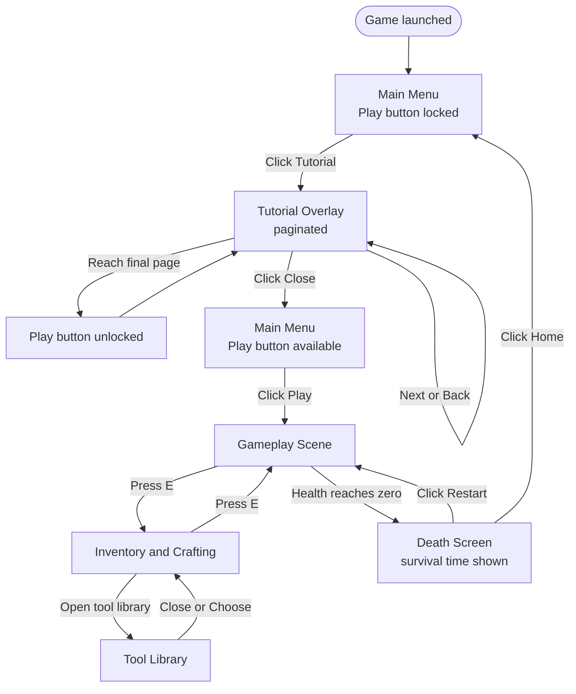

# CHƯƠNG 4 - SOFTWARE PRODUCT REQUIREMENTS
### Bản tiếng Việt (bản duyệt nội dung)

> **Ghi chú:**
> - Ngôi thứ ba, giọng bị động. Không dùng "tôi", không dùng "tác giả". Chỉ dùng dấu gạch thường `-`.
> - **Có 7 sơ đồ** viết bằng Mermaid. Cách dùng: mở [mermaid.live](https://mermaid.live), dán khối code vào ô bên trái, ảnh hiện bên phải, bấm **Actions > PNG** hoặc **SVG** để tải về rồi chèn vào báo cáo.
> - Khi chèn ảnh nhớ đánh số hình và ghi chú thích; số hình để trống điền sau khi chốt toàn bài.

---

## 4.0 Giới thiệu chương

Chương này xác định các yêu cầu của sản phẩm WildBound. Nội dung bắt đầu bằng việc khảo sát một sản phẩm thương mại cùng thể loại để rút ra bài học thiết kế, sau đó trình bày các yêu cầu chức năng thông qua sơ đồ ca sử dụng và các câu chuyện người dùng, tiếp theo là đặc tả chi tiết những ca sử dụng phức tạp nhất kèm sơ đồ hoạt động và sơ đồ tuần tự, và kết thúc bằng mô hình dữ liệu cùng sơ đồ luồng màn hình.

---

## 4.1 Khảo sát sản phẩm tương tự: Green Hell

### Giới thiệu sản phẩm

*Green Hell* là trò chơi sinh tồn góc nhìn thứ nhất do studio độc lập Creepy Jar phát triển, phát hành bản truy cập sớm tháng 8 năm 2018 và bản hoàn chỉnh vào tháng 9 năm 2019 (Creepy Jar 2019). Bối cảnh trò chơi là rừng nhiệt đới Amazon, nơi người chơi điều khiển một nhân vật bị mắc kẹt và phải tự duy trì sự sống.

Sản phẩm này được lựa chọn để khảo sát vì nó là trường hợp gần WildBound nhất trong số các trò chơi sinh tồn thương mại: cùng góc nhìn thứ nhất, cùng bối cảnh môi trường tự nhiên biệt lập, cùng cơ chế chế tạo công cụ từ gỗ và đá, và cùng hệ thống chỉ số sinh tồn suy giảm theo thời gian.

### Phân tích các hệ thống chính

**Hệ thống chỉ số sinh tồn.** Green Hell xây dựng một hệ thống chỉ số nhiều tầng. Ngoài các chỉ số cơ bản là đói, khát và mức độ nghỉ ngơi, trò chơi còn tách riêng bốn chỉ số dinh dưỡng gồm chất đạm, tinh bột, chất béo và nước, mỗi chỉ số phải được duy trì độc lập. Bên trên các chỉ số này còn có hệ thống kiểm tra cơ thể, cho phép người chơi tự quan sát các bộ phận để phát hiện vết thương, nhiễm trùng, gãy xương và ký sinh trùng, sau đó xử lý từng tình trạng bằng tài nguyên phù hợp.

**Hệ thống tinh thần.** Điểm đặc trưng nhất của Green Hell là chỉ số tinh thần, gắn trạng thái tâm lý của nhân vật với tình trạng thể chất. Dinh dưỡng kém, chấn thương và việc tiếp xúc kéo dài với các tình huống căng thẳng đều làm suy giảm chỉ số này, dẫn tới ảo giác và thay đổi hành vi của nhân vật.

**Hệ thống chế tạo.** Gậy, đá, dây leo và xương được kết hợp thành công cụ và vũ khí. Điểm đáng chú ý về mặt thiết kế là công thức chế tạo được lưu trong một cuốn sổ tay và **chỉ được ghi vào sổ sau khi người chơi tự khám phá ra tổ hợp đó**, thay vì hiển thị đầy đủ ngay từ đầu.

### Đối chiếu với WildBound

| Khía cạnh | Green Hell | WildBound |
|---|---|---|
| Góc nhìn | Thứ nhất | Thứ nhất |
| Chỉ số sinh tồn | Đói, khát, nghỉ ngơi, tinh thần, cùng bốn chỉ số dinh dưỡng riêng | Máu, đói, khát |
| Tình trạng cơ thể | Vết thương, nhiễm trùng, gãy xương, ký sinh trùng | Không có |
| Công thức chế tạo | Ẩn, ghi vào sổ sau khi tự khám phá | Hiển thị đầy đủ trong thư viện công cụ |
| Xây dựng nơi trú ẩn | Có | Không có |
| Cốt truyện | Có chế độ cốt truyện | Không có |
| Điều kiện thắng | Có, ở chế độ cốt truyện | Không có, chỉ đo thời gian sống sót |

### Bài học rút ra và các quyết định thiết kế

Việc khảo sát này dẫn tới ba quyết định cụ thể cho WildBound.

**Thứ nhất, giữ số lượng chỉ số ở mức tối thiểu.** Hệ thống bảy chỉ số của Green Hell tạo ra chiều sâu đáng kể, nhưng cũng đòi hỏi người chơi ghi nhớ và theo dõi nhiều thông tin cùng lúc. Với phạm vi của một đồ án tốt nghiệp, WildBound chỉ giữ ba chỉ số, đổi lại đầu tư vào việc làm cho ba chỉ số đó thực sự tương tác với nhau thay vì vận hành độc lập - cụ thể là cơ chế hồi máu có điều kiện và có chi phí, đã trình bày tại mục 6.3.3.

**Thứ hai, hiển thị công thức thay vì ẩn đi.** Đây là điểm WildBound đi ngược lại Green Hell một cách có chủ đích. Cơ chế khám phá công thức của Green Hell tạo ra phần thưởng khi người chơi tự tìm ra tổ hợp đúng, nhưng đồng thời cũng tạo ra rủi ro bế tắc khi người chơi không đoán được. Do WildBound có số lượng công thức nhỏ và thời gian chơi mỗi lượt ngắn, việc ẩn công thức sẽ gây bực bội nhiều hơn là tạo hứng thú. Thư viện công cụ vì vậy hiển thị toàn bộ công thức kèm số lượng nguyên liệu ngay từ đầu.

**Thứ ba, không xây dựng hệ thống nơi trú ẩn và cốt truyện.** Cả hai đều nằm ngoài phạm vi khả thi của đồ án. Việc loại bỏ chúng cho phép tập trung nguồn lực vào vòng lặp cốt lõi, phù hợp với quyết định thu hẹp phạm vi đã trình bày tại mục 1.2.

---

## 4.2 Sơ đồ ca sử dụng và câu chuyện người dùng

### Các tác nhân

WildBound là trò chơi một người chơi, do đó chỉ có hai tác nhân:

- **Người chơi (Player)**: tác nhân chính, thực hiện toàn bộ hành động tương tác.
- **Hệ thống (System)**: tác nhân đại diện cho các tiến trình tự động chạy theo thời gian mà không cần người chơi kích hoạt, gồm việc hồi sinh bụi cây, sinh đá từ tảng đá lớn, sinh thỏ từ hang và chu kỳ xuất hiện của thỏ đầu đàn.

### Sơ đồ ca sử dụng

Do WildBound có số lượng hành động khá lớn, các ca sử dụng được trình bày qua ba sơ đồ phân theo nhóm chức năng, thay vì dồn vào một hình duy nhất vốn sẽ rất khó đọc.

📌 **[HÌNH __]** *Sơ đồ ca sử dụng: di chuyển và quản lý túi đồ*

📌 **[HÌNH __]** *Sơ đồ ca sử dụng: thu thập tài nguyên, chế tạo và chiến đấu*

📌 **[HÌNH __]** *Sơ đồ ca sử dụng: tương tác bếp lửa, giao diện và các tiến trình tự động*

### Câu chuyện người dùng

Các ca sử dụng chính được diễn đạt lại dưới dạng câu chuyện người dùng như sau:

| Mã | Câu chuyện người dùng |
|---|---|
| US-01 | Là người chơi, tôi muốn nhặt tài nguyên trên bản đồ để có nguyên liệu chế tạo công cụ. |
| US-02 | Là người chơi, tôi muốn xem toàn bộ công thức chế tạo để không phải ghi nhớ hay đoán mò. |
| US-03 | Là người chơi, tôi muốn hệ thống tự lấy nguyên liệu từ túi đồ khi chọn một công thức để tiết kiệm thao tác. |
| US-04 | Là người chơi, tôi muốn chế tạo rìu và cuốc chim để thu thập tài nguyên nhanh hơn dùng tay không. |
| US-05 | Là người chơi, tôi muốn đun sôi nước trước khi uống để phục hồi chỉ số khát một cách an toàn. |
| US-06 | Là người chơi, tôi muốn nấu chín thịt trước khi ăn để phục hồi chỉ số đói. |
| US-07 | Là người chơi, tôi muốn nạp gậy và đá thừa vào bếp lửa để kéo dài tuổi thọ của bếp. |
| US-08 | Là người chơi, tôi muốn nhìn thấy lượng máu của sinh vật trước khi tấn công để quyết định có giao chiến hay không. |
| US-09 | Là người chơi, tôi muốn nhận biết được thỏ đầu đàn từ xa để chuẩn bị trước hoặc tránh né. |
| US-10 | Là người chơi, tôi muốn được cảnh báo rõ ràng khi đang mất máu để kịp phản ứng. |
| US-11 | Là người chơi, tôi muốn đọc hướng dẫn trước khi chơi để nắm được các cơ chế không thể tự phát hiện. |
| US-12 | Là người chơi, tôi muốn biết thời gian sống sót của mình để so sánh với các lượt chơi trước. |
| US-13 | Là người chơi, tôi muốn bắt đầu lại ngay sau khi chết để thử lại mà không phải thoát trò chơi. |

---

## 4.3 Đặc tả ca sử dụng và các sơ đồ hành vi

### 4.3.1 Đặc tả ca sử dụng chi tiết

Bốn ca sử dụng phức tạp nhất được đặc tả đầy đủ dưới đây.

#### UC-01: Chế tạo vật phẩm

| Mục | Nội dung |
|---|---|
| **Tác nhân** | Người chơi |
| **Mô tả** | Người chơi kết hợp hai loại nguyên liệu theo một công thức để tạo ra vật phẩm mới |
| **Tiền điều kiện** | Giao diện túi đồ đang mở; người chơi sở hữu đủ số lượng của cả hai loại nguyên liệu |
| **Luồng chính** | 1. Người chơi kéo nguyên liệu thứ nhất vào ô đầu vào thứ nhất 2. Người chơi kéo nguyên liệu thứ hai vào ô đầu vào thứ hai 3. Hệ thống duyệt danh sách công thức và chọn công thức khớp có tổng nguyên liệu cao nhất 4. Hệ thống kích hoạt nút chế tạo 5. Người chơi bấm nút chế tạo 6. Hệ thống trừ đúng số lượng nguyên liệu từ hai ô đầu vào 7. Hệ thống tạo vật phẩm kết quả vào ô đầu ra |
| **Luồng thay thế** | 3a. Không có công thức nào khớp: nút chế tạo giữ trạng thái vô hiệu, luồng kết thúc 3b. Nguyên liệu đúng loại nhưng không đủ số lượng: nút chế tạo giữ trạng thái vô hiệu 1a. Thứ tự đặt nguyên liệu bị đảo: hệ thống vẫn nhận diện đúng công thức |
| **Hậu điều kiện** | Nguyên liệu bị trừ khỏi túi đồ; vật phẩm mới xuất hiện trong ô đầu ra |

#### UC-02: Đun sôi nước

| Mục | Nội dung |
|---|---|
| **Tác nhân** | Người chơi |
| **Mô tả** | Người chơi biến nước bẩn thành nước sạch thông qua bếp lửa |
| **Tiền điều kiện** | Người chơi sở hữu nồi; tồn tại nguồn nước và một bếp lửa còn độ bền trên bản đồ |
| **Luồng chính** | 1. Người chơi cầm nồi và hướng tầm nhìn vào nguồn nước 2. Hệ thống hiển thị gợi ý thao tác 3. Người chơi bấm chuột trái, nồi chuyển thành nồi nước bẩn 4. Người chơi cầm nồi nước bẩn và hướng tầm nhìn vào bếp lửa ở trạng thái thường 5. Người chơi bấm chuột trái, hệ thống trừ độ bền bếp và chuyển bếp sang trạng thái đang đun 6. Hệ thống đếm thời gian đun, sau đó chuyển bếp sang trạng thái đã đun xong 7. Người chơi cầm chai rỗng và hướng tầm nhìn vào bếp 8. Người chơi bấm chuột trái, chai rỗng chuyển thành chai nước sạch |
| **Luồng thay thế** | 4a. Bếp không ở trạng thái thường: thao tác không được thực hiện 8a. Sau lần múc thứ ba, bếp trở về trạng thái thường và nhả nồi ra ngoài 8b. Nếu bếp đã hết độ bền tại thời điểm đó, bếp bị phá hủy nhưng vẫn nhả nồi |
| **Hậu điều kiện** | Người chơi sở hữu chai nước sạch; độ bền bếp giảm |

#### UC-03: Nấu thịt

| Mục | Nội dung |
|---|---|
| **Tác nhân** | Người chơi |
| **Mô tả** | Người chơi biến thịt sống thành thịt chín tại bếp lửa |
| **Tiền điều kiện** | Người chơi sở hữu thịt sống; tồn tại bếp lửa còn độ bền |
| **Luồng chính** | 1. Người chơi cầm thịt sống và hướng tầm nhìn vào bếp lửa 2. Hệ thống hiển thị gợi ý giữ phím F 3. Người chơi giữ phím F 4. Hệ thống tăng dần bộ đếm thời gian và hiển thị tiến trình theo phần trăm 5. Khi đủ thời gian yêu cầu, hệ thống trừ một đơn vị thịt sống, thêm một đơn vị thịt chín vào túi đồ và trừ độ bền bếp |
| **Luồng thay thế** | 3a. Người chơi thả phím hoặc quay đi: bộ đếm bị đặt lại về không 1a. Bếp đã hết độ bền: hệ thống hiển thị thông báo bếp hỏng và không cho phép nấu |
| **Hậu điều kiện** | Túi đồ có thêm thịt chín; độ bền bếp giảm |

#### UC-04: Tấn công sinh vật

| Mục | Nội dung |
|---|---|
| **Tác nhân** | Người chơi |
| **Mô tả** | Người chơi tấn công thỏ để thu thịt sống |
| **Tiền điều kiện** | Tồn tại sinh vật trong tầm tấn công; khoảng thời gian chờ giữa hai đòn đã kết thúc |
| **Luồng chính** | 1. Người chơi hướng tầm nhìn vào sinh vật 2. Người chơi bấm chuột trái 3. Hệ thống phóng tia từ camera và xác định mục tiêu 4. Hệ thống tính sát thương theo công cụ đang cầm và trừ máu sinh vật 5. Sinh vật chuyển sang trạng thái hung dữ và bắt đầu truy đuổi 6. Khi máu sinh vật về không, hệ thống hủy sinh vật và tạo thịt sống tại vị trí đó |
| **Luồng thay thế** | 4a. Người chơi cầm rìu hoặc cuốc: sát thương cao hơn, đồng thời trừ một điểm độ bền công cụ 4b. Công cụ hết độ bền: công cụ bị phá hủy và biến mất khỏi túi đồ 1a. Mục tiêu là thỏ đầu đàn: sinh vật đã ở trạng thái hung dữ sẵn do tự phát hiện người chơi 6a. Mục tiêu là thỏ đầu đàn: hệ thống tạo hai đơn vị thịt sống và khởi động lại chu kỳ sinh thỏ đầu đàn |
| **Hậu điều kiện** | Sinh vật bị hủy; thịt sống xuất hiện trên bản đồ; độ bền công cụ giảm nếu có sử dụng công cụ |

### 4.3.2 Sơ đồ hoạt động: chuỗi xử lý nước và thức ăn

Sơ đồ dưới đây mô tả toàn bộ chuỗi tương tác với bếp lửa, bao gồm cả nhánh đun nước lẫn nhánh nấu thịt và nhánh tiếp nhiên liệu.

📌 **[HÌNH __]** *Sơ đồ hoạt động của chuỗi tương tác với bếp lửa*

### 4.3.3 Sơ đồ ngữ cảnh

Sơ đồ ngữ cảnh xác định ranh giới của hệ thống và các thực thể bên ngoài tương tác với nó.

📌 **[HÌNH __]** *Sơ đồ ngữ cảnh của WildBound*

### 4.3.4 Sơ đồ tuần tự

**Luồng thứ nhất: tấn công sinh vật và nhận vật phẩm rơi ra.** Luồng này thể hiện sự phối hợp giữa bốn thành phần khi người chơi hạ một sinh vật.

📌 **[HÌNH __]** *Sơ đồ tuần tự của luồng tấn công sinh vật*

**Luồng thứ hai: chế tạo vật phẩm.** Luồng này thể hiện quá trình từ khi người chơi đặt nguyên liệu tới khi vật phẩm được tạo ra.

📌 **[HÌNH __]** *Sơ đồ tuần tự của luồng chế tạo*

---

## 4.4 Mô hình dữ liệu

### Lý do không sử dụng sơ đồ quan hệ thực thể theo nghĩa cơ sở dữ liệu

WildBound là trò chơi ngoại tuyến dành cho một người chơi và không sử dụng cơ sở dữ liệu. Toàn bộ trạng thái của trò chơi tồn tại trong bộ nhớ trong suốt phiên chơi và bị xóa khi thoát, còn dữ liệu cấu hình được lưu dưới dạng tài nguyên của engine chứ không phải bản ghi trong bảng.

Do đó, thay cho một sơ đồ quan hệ thực thể theo nghĩa thông thường, mục này trình bày **mô hình quan hệ giữa các thực thể dữ liệu trong trò chơi**. Mô hình vẫn tuân theo cách biểu diễn quen thuộc với các thuộc tính và quan hệ, nhưng các thực thể ở đây là lớp dữ liệu trong bộ nhớ thay vì bảng trong cơ sở dữ liệu.

📌 **[HÌNH __]** *Mô hình dữ liệu của WildBound*

### Giải thích các quan hệ chính

`GAMECONFIG` là thực thể trung tâm về mặt cấu hình: nó cung cấp tham số cho toàn bộ các thực thể có hành vi phụ thuộc vào số liệu cân bằng, nhưng bản thân nó không bị các thực thể đó sửa đổi. Đây là biểu hiện trực tiếp của nguyên tắc thiết kế hướng dữ liệu.

`ITEMSLOT` và `CRAFTINGSLOT` có quan hệ **không hoặc một** với `ITEMDATA`: mỗi ô chứa nhiều nhất một vật phẩm. Cần lưu ý rằng số lượng vật phẩm không được biểu diễn bằng nhiều bản ghi mà bằng thuộc tính `currentStack` trên chính `ITEMDATA`, đây là lý do một ô chỉ liên kết với tối đa một thực thể.

`CRAFTINGRECIPE` liên kết với `ITEMDATA` theo hai vai trò khác nhau: hai loại nguyên liệu đầu vào và một loại kết quả đầu ra. Liên kết này không phải bằng khóa ngoại mà bằng **so khớp tên dạng chuỗi**, phù hợp với cơ chế nạp tài nguyên theo tên của engine.

---

## 4.5 Sơ đồ luồng màn hình

Do WildBound là ứng dụng độc lập chứ không phải trang web, khái niệm sơ đồ trang web được thay bằng sơ đồ luồng màn hình, mô tả các trạng thái giao diện và cách người chơi di chuyển giữa chúng.

📌 **[HÌNH __]** *Sơ đồ luồng màn hình của WildBound*

### Giải thích

Sơ đồ cho thấy hai điểm đáng chú ý về mặt thiết kế luồng.

Thứ nhất, **lớp phủ hướng dẫn không phải một cảnh riêng biệt** mà là một lớp giao diện nằm trên màn hình chính. Camera nền vẫn tiếp tục hoạt động phía sau, và việc chuyển đổi không đòi hỏi tải lại cảnh.

Thứ hai, **nút bắt đầu bị khóa cho tới khi người chơi đọc hết hướng dẫn**, và trạng thái này được đặt lại mỗi lần cảnh màn hình chính được tải. Điều này có nghĩa là khi người chơi bấm quay về màn hình chính từ màn hình kết thúc, họ sẽ gặp lại trạng thái khóa ban đầu.

---

# TÀI LIỆU THAM KHẢO CHO CHƯƠNG 4

Creepy Jar (2019) *Green Hell* [computer game], Creepy Jar, Warsaw.
