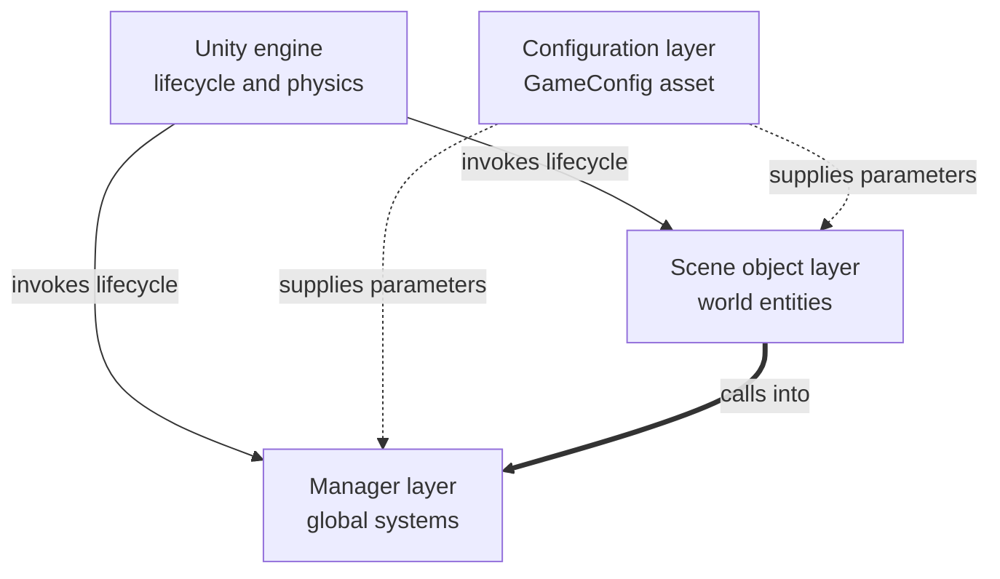
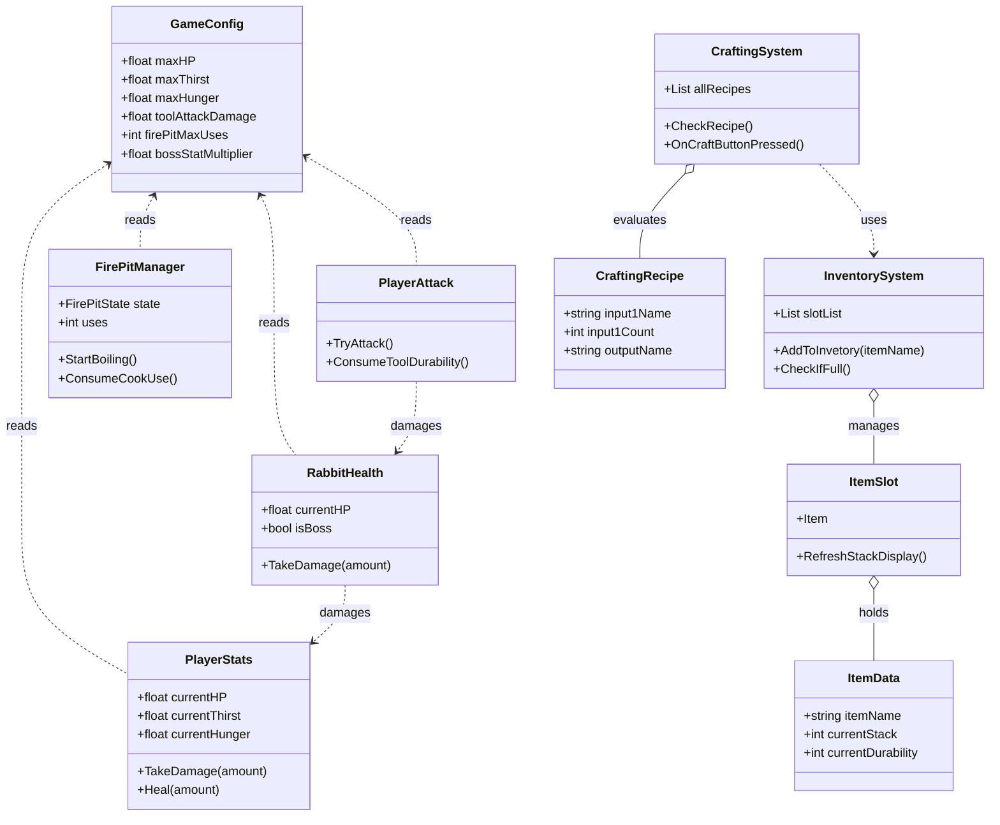
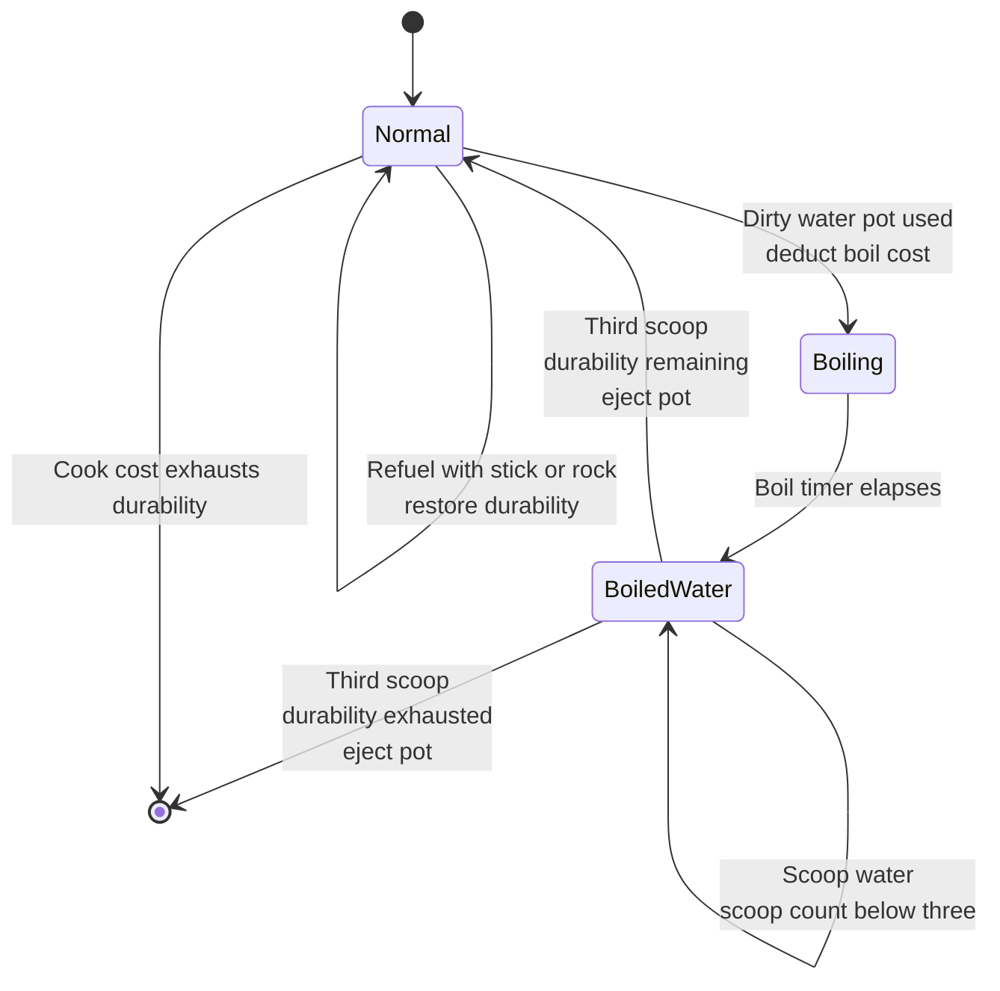
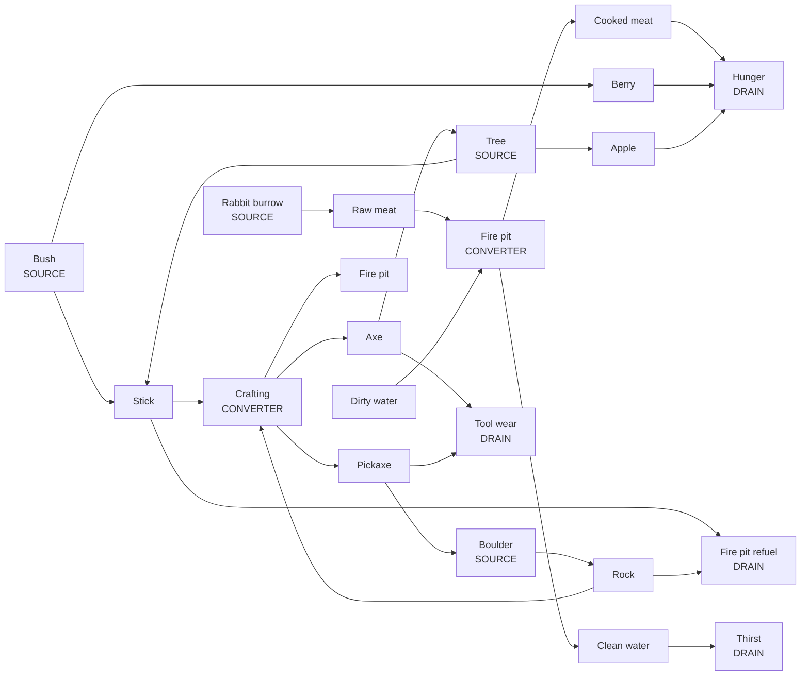

> **⚠️ GHI CHÚ - XÓA KHỐI NÀY TRƯỚC KHI NỘP**
>
> - Ngôi thứ ba, giọng bị động. Không dùng "I", không dùng "the author". Chỉ dùng dấu gạch thường `-`.
> - **Có 5 sơ đồ Mermaid.** Render tại [mermaid.live](https://mermaid.live), xuất PNG rồi chèn ảnh vào báo cáo.
> - Mục này **không chèn ảnh chụp màn hình** - ảnh nằm ở §6.2, ở đây chỉ tham chiếu ngược lại.
> - Mục này đặt **trước** §6.2 trong báo cáo, dù được viết sau cùng.

---

# CHAPTER 6 - DESIGN AND IMPLEMENTATION OF WILDBOUND

## 6.0 Chapter Introduction

This chapter presents the demonstration product itself across four sections. Section 6.1 sets out the internal design of the system, covering the interface, the decomposition into components and the detailed design of the principal systems. Section 6.2 presents the finished features as the player encounters them. Section 6.3 examines representative pieces of the implementation in detail. Section 6.4 evaluates the product against the criteria established for it.

The four sections are deliberately ordered from the inside outwards and then back again: from how the product was designed, to what it became, to how that was written in code, and finally to how well it succeeded.

---

## 6.1 Product Analysis and Design

This section presents the internal structure of WildBound: how the interface was designed, how the system is decomposed into components, and how those components work together. Where Section 6.2 describes the product from the player's point of view, this section describes it from the developer's.

---

### 6.1.1 Graphical User Interface Design

#### Design Method

The WildBound interface was designed directly within the Unity editor in an iterative manner, without a preceding stage of paper sketches or interactive mock-ups.

It should be stated that this was a considered choice rather than an omission. In an individual project the designer and the implementer are the same person, so a sketch loses its most important function, namely communicating an idea between team members. At the same time, building directly in the editor gives immediate visual feedback at the true screen proportions, which a sketch cannot provide. The trade-off is that no interface design documentation was preserved during development, and the layout decisions had to be reconstructed from the product itself when this report was written.

#### The Layout Principles Applied

**First principle: information at the edges, the centre left clear.** Every in-game interface element is placed against the edges of the screen. The central region, where the player observes and aims, is kept entirely unobstructed. The single exception is the interaction prompt, which appears near the centre but only while the player is looking at an interactable object - that is, precisely when the information is required.

**Second principle: status bars and numerical values displayed together.** The three survival statistics are shown simultaneously as both a graphical bar and a number. This serves two different needs: the bar allows the level of danger to be judged through peripheral vision without looking away from the centre, while the numerical value supports precise decisions, such as weighing whether enough water remains to sprint.

**Third principle: reuse of display positions.** The corner of each inventory slot serves two different kinds of information: item quantity for stackable items, and remaining durability for tools. Since an item cannot both stack and possess durability, the two never conflict, so sharing one position reduces the number of interface elements that must be managed.

**Fourth principle: immediate feedback for every significant action.** Every action carrying a consequence is accompanied by a visual signal at the moment it occurs, rather than leaving the player to infer it from watching the statistics. A detailed table of the feedback mechanisms is presented in Section 6.4.5.

The visible expression of these principles can be seen in the screenshots presented in Section 6.2.

---

### 6.1.2 System Analysis

#### System Decomposition

WildBound is decomposed into six groups of systems, each carrying its own area of responsibility:

| Group | Responsibility | Principal components |
|---|---|---|
| Player control | Movement, camera rotation, sprinting | `PlayerMovement`, `MouseMovement` |
| Survival statistics | Depletion, regeneration, damage, death | `PlayerStats`, `DamageFlash`, `DeadScreen` |
| Item management | Storage, stacking, drag-and-drop, selection | `InventorySystem`, `ItemSlot`, `DragDrop`, `HotbarSelection` |
| Crafting | Recipe matching, ingredient consumption, reference | `CraftingSystem`, `CraftingSlot`, `ToolLibraryUI` |
| World interaction | Target detection, gathering, combat, cooking | `SelectionManager`, `PlayerAttack`, `PotInteraction`, `Tree`, `Bush`, `BigRock`, `FirePitManager` |
| Creatures | Behaviour, health, spawning | `AI_Movement`, `RabbitHealth`, `RabbitSpawner` |

#### The Architecture of Communication Between Systems

These groups hold no direct references to one another. Instead, systems requiring access from many places are implemented as single instances with a global access point, while configuration data is supplied centrally from a separate asset.

📌 **[FIGURE __]** *Architecture of communication between the systems of WildBound*

The components belonging to each layer are listed in the decomposition table above: the scene object layer comprises the world interaction and creature groups, while the manager layer comprises the item management, crafting and survival statistics groups.

The diagram shows three characteristics of the architecture. First, dependency flows in a single direction: objects in the scene layer call into the manager layer, but no manager ever calls back into a scene object. Second, the configuration layer supplies parameters to both of the layers below it yet is modified by neither, which is a direct expression of the data-driven design principle. Third, the engine itself drives both layers through the script lifecycle rather than through any call originating inside the project, which is why the ordering guarantees of that lifecycle matter as much as they do, as discussed in Section 3.1.3.

Individual calls between specific classes are deliberately not shown at this level of abstraction; they are presented in the class diagram below and in the sequence diagrams of Section 4.3.4.

---

### 6.1.3 Basic Design

#### The Overall Architectural Model

WildBound is built on Unity's component-based model, in which behaviour is attached to objects rather than inherited. Layered above this model, the project applies two further organising principles: manager systems use the single-instance pattern, and all balance data is separated from the logic-processing code.

#### Project Conventions

The project follows four conventions, applied consistently throughout the codebase:

| Convention | Content |
|---|---|
| Folder structure | Source code divided by function: `Core`, `Player`, `UI`, `Interaction`, `Mobs` |
| Loading assets by name | Interface prefabs in `Resources/`, three-dimensional world prefabs in `Resources/WorldItems/`, loaded by string name at runtime |
| Tags | `Slot` for inventory slots, `Player` for the character, `Water` for water sources, `FirePit` for fire pits |
| Layers | The `Ground` layer is excluded from the raycast used by the target selection system |

The convention of loading assets by name carries one consequence worth noting: an item's identity is established by a character string rather than by a direct reference, so renaming a prefab breaks the link without producing any compilation error.

#### Class Diagram of the Core Components

📌 **[FIGURE __]** *Condensed class diagram of the core components*

---

### 6.1.4 Detailed Design

The four systems whose design is of greatest interest are presented in detail below.

#### a) The Inventory and Hotbar System

The storage system comprises 32 slots, of which the first eight also serve as the hotbar. The slot list is assembled at start-up by scanning for objects carrying the `Slot` tag, scanning the hotbar region first and the inventory region afterwards. That scanning order is precisely the mechanism guaranteeing that new items fill the hotbar before the inventory.

The most notable design point concerns how the item within a slot is identified. Since each slot also contains the quantity display element, retrieval by positional index would return the wrong object. The solution is retrieval by type: the slot iterates over its child objects and returns whichever carries the item data component. This approach depends on neither the order nor the number of child objects, so it remains correct should the slot's structure change later.

Item quantity is represented not by multiple objects but by a counter attribute on the item object itself. A stack of ten units therefore costs one object rather than ten.

#### b) The Crafting System

The system comprises three dedicated slots and a recipe list stored as independent assets. Each time the contents of an input slot change, the system traverses the whole recipe list and selects the best match.

The matching algorithm must satisfy two requirements simultaneously. The first is that the order in which ingredients are placed must not affect the outcome, so each recipe is tested in both orientations. The second is that where several recipes share a pair of ingredients, the system must select the one the player expects; this is resolved by giving precedence to the recipe with the highest total ingredient count. The detailed analysis and accompanying code are presented in Section 6.3.2.

The tool library is a reference layer sitting above the crafting system. The selection button attached to each recipe does not generate new items but **moves the player's existing items** into the two input slots, gathering from several slots where necessary. This design ensures the tool library remains a convenience for handling items rather than becoming a shortcut that creates resources for free.

#### c) The Fire Pit State Machine

The fire pit is the entity with the most complex behaviour in the game, possessing three states with transitions driven both by player action and by the passage of time.

📌 **[FIGURE __]** *State diagram of the fire pit*

Each transition is implemented by destroying the current object and creating a new one from the corresponding prefab, while manually transferring the progress data comprising the state, the remaining durability and the number of scoops taken. This approach was chosen because the fire pit states differ not only in their display model but also in their particle effects and child object structure, which makes swapping individual parts more involved than replacing the whole. The code and full analysis are presented in Section 6.3.1.

The same design pattern is applied again to the bush with its two states, differing only in the set of data transferred.

#### d) The Resource Life Cycle

The resource economy was designed according to the vocabulary of sources, converters and drains presented in Section 2.3.

📌 **[FIGURE __]** *Resource life cycle in WildBound*

The diagram clarifies three characteristics of the design. First, every resource type has at least two independent sources, so losing one cannot produce an impasse. Second, a positive feedback loop exists between tools and resources: the axe unlocks trees, trees yield sticks, and sticks in turn serve further crafting. Third, the drains are arranged so that every resource type has somewhere to be spent even once the player has crafted every tool - which is precisely the role played by the fire pit refuelling mechanism.

The quantitative analysis of this economy's soundness, together with the figures for each recipe's cost, is presented in Section 6.4.3.
