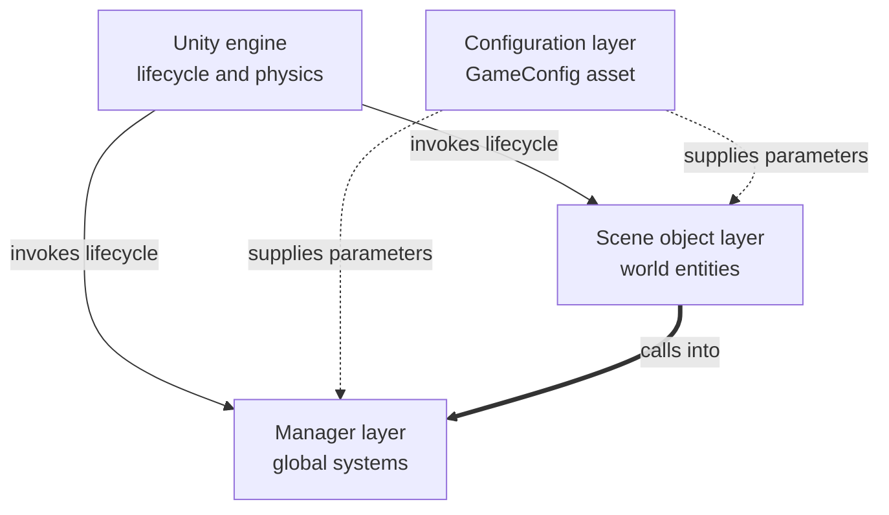
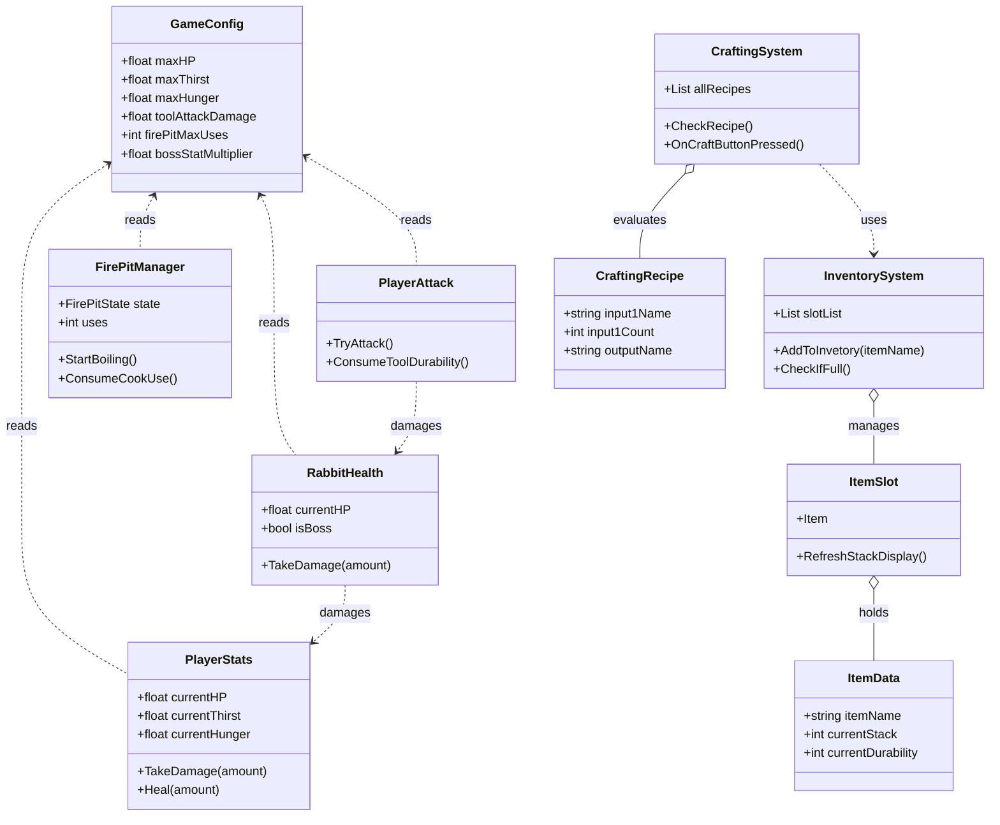
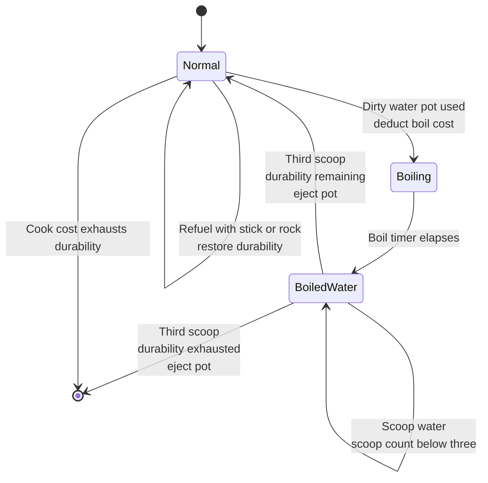
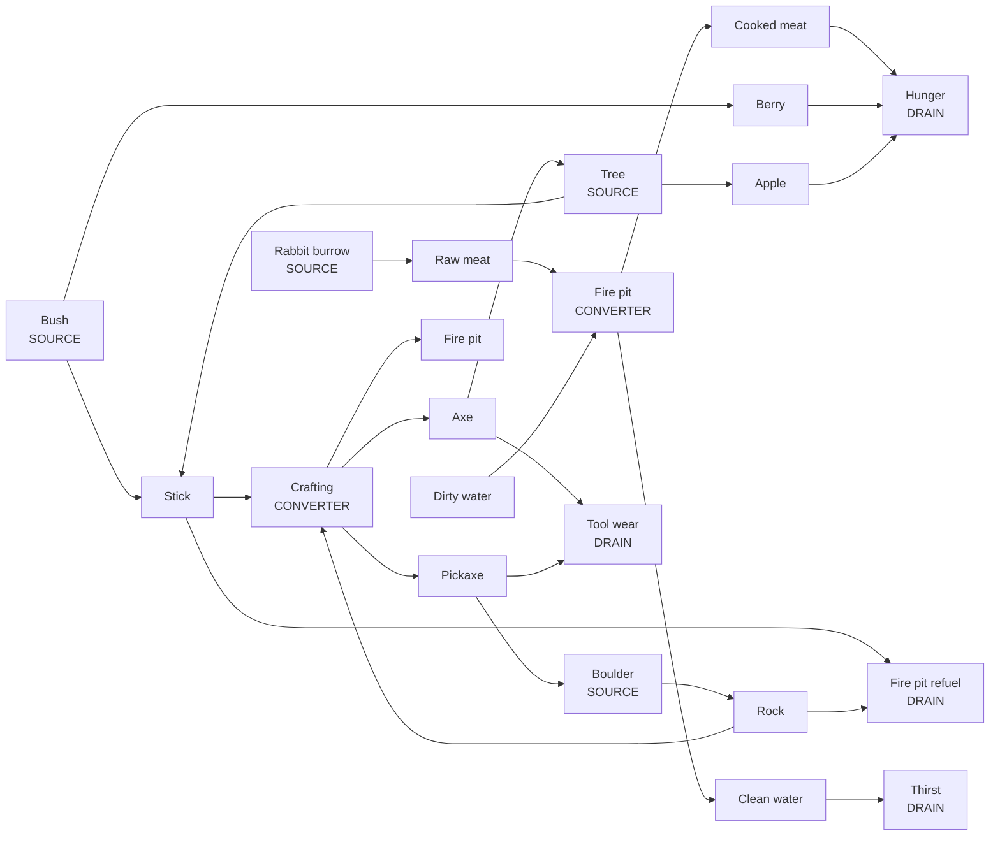

# MỤC 6.1 - PRODUCT ANALYSIS AND DESIGN
### Bản tiếng Việt (bản duyệt nội dung)

> **Ghi chú:**
> - Ngôi thứ ba, giọng bị động. Không dùng "tôi", không dùng "tác giả". Chỉ dùng dấu gạch thường `-`.
> - **Có 5 sơ đồ Mermaid.** Render tại [mermaid.live](https://mermaid.live), xuất PNG rồi chèn vào báo cáo.
> - Mục này **không chèn ảnh chụp màn hình** - ảnh nằm ở 6.2, ở đây chỉ tham chiếu ngược lại để tránh trùng lặp.

---

# CHƯƠNG 6 - DESIGN AND IMPLEMENTATION OF WILDBOUND

## 6.0 Giới thiệu chương

Chương này trình bày bản thân sản phẩm demo qua bốn mục. Mục 6.1 trình bày thiết kế bên trong của hệ thống, gồm giao diện, việc phân rã thành các thành phần và thiết kế chi tiết của các hệ thống chính. Mục 6.2 trình bày các tính năng đã hoàn thiện dưới góc nhìn người chơi. Mục 6.3 phân tích chi tiết những đoạn mã nguồn tiêu biểu. Mục 6.4 đánh giá sản phẩm theo các tiêu chí đã đặt ra.

Bốn mục được sắp xếp có chủ đích theo trình tự từ trong ra ngoài rồi quay ngược lại: từ cách sản phẩm được thiết kế, tới hình hài nó trở thành, tới cách điều đó được viết thành mã nguồn, và cuối cùng là mức độ thành công đạt được.

---

## 6.1 Phân tích và thiết kế sản phẩm

Mục này trình bày cấu trúc bên trong của WildBound: cách giao diện được thiết kế, cách hệ thống được phân rã thành các thành phần, và cách các thành phần đó phối hợp với nhau. Nếu mục 6.2 mô tả sản phẩm từ góc nhìn của người chơi, thì mục này mô tả nó từ góc nhìn của người phát triển.

---

### 6.1.1 Thiết kế giao diện người dùng

#### Phương pháp thiết kế

Giao diện của WildBound được thiết kế trực tiếp trong trình soạn thảo của Unity theo hướng lặp, không thông qua bước dựng bản phác thảo giấy hay bản mẫu tương tác trước.

Cần nêu rõ đây là một lựa chọn có cân nhắc chứ không phải sự bỏ sót. Đối với một đồ án cá nhân, người thiết kế và người hiện thực là cùng một người, nên bản phác thảo mất đi chức năng quan trọng nhất của nó là công cụ truyền đạt ý tưởng giữa các thành viên. Đồng thời, việc dựng trực tiếp trong trình soạn thảo cho phản hồi thị giác ngay lập tức và ở đúng tỷ lệ màn hình thật, điều mà bản phác thảo không làm được. Đánh đổi của lựa chọn này là không có tài liệu thiết kế giao diện được lưu lại trong quá trình phát triển, và các quyết định về bố cục phải được dựng lại từ sản phẩm khi viết báo cáo.

#### Các nguyên tắc bố cục được áp dụng

**Nguyên tắc thứ nhất: thông tin đặt ở rìa, trung tâm để trống.** Toàn bộ thành phần giao diện trong lúc chơi được đặt sát các cạnh màn hình. Vùng trung tâm, nơi người chơi quan sát và nhắm mục tiêu, được giữ hoàn toàn thông thoáng. Ngoại lệ duy nhất là dòng chữ gợi ý tương tác, xuất hiện gần tâm màn hình nhưng chỉ khi người chơi đang hướng tầm nhìn vào một vật thể tương tác được, tức là đúng lúc thông tin đó cần thiết.

**Nguyên tắc thứ hai: hiển thị song song thanh trạng thái và giá trị số.** Ba chỉ số sinh tồn được thể hiện đồng thời bằng cả thanh đồ họa lẫn con số. Cách này phục vụ hai nhu cầu khác nhau: thanh đồ họa cho phép nhận biết mức độ nguy hiểm bằng thị giác ngoại vi mà không cần rời mắt khỏi trung tâm, còn giá trị số phục vụ việc ra quyết định chính xác, chẳng hạn khi cân nhắc có đủ nước để chạy nhanh hay không.

**Nguyên tắc thứ ba: tái sử dụng vị trí hiển thị.** Góc mỗi ô chứa đồ được dùng chung cho hai loại thông tin khác nhau: số lượng vật phẩm đối với vật phẩm xếp chồng, và độ bền còn lại đối với công cụ. Do một vật phẩm không thể vừa xếp chồng vừa có độ bền, hai loại thông tin này không bao giờ xung đột, nên việc dùng chung một vị trí giúp giảm số thành phần giao diện cần quản lý.

**Nguyên tắc thứ tư: phản hồi tức thì cho mọi hành động quan trọng.** Mỗi hành động có hệ quả đều đi kèm một tín hiệu thị giác ngay tại thời điểm xảy ra, thay vì để người chơi tự suy ra từ việc quan sát các chỉ số. Bảng chi tiết các cơ chế phản hồi được trình bày tại mục 6.4.5.

Biểu hiện trực quan của các nguyên tắc trên có thể thấy trong các hình chụp màn hình tại mục 6.2.

---

### 6.1.2 Phân tích hệ thống

#### Phân rã hệ thống

WildBound được phân rã thành sáu nhóm hệ thống, mỗi nhóm đảm nhiệm một phạm vi trách nhiệm riêng:

| Nhóm | Trách nhiệm | Thành phần chính |
|---|---|---|
| Điều khiển người chơi | Di chuyển, xoay camera, chạy nhanh | `PlayerMovement`, `MouseMovement` |
| Chỉ số sinh tồn | Tiêu hao, hồi phục, sát thương, tử vong | `PlayerStats`, `DamageFlash`, `DeadScreen` |
| Quản lý vật phẩm | Lưu trữ, xếp chồng, kéo thả, lựa chọn | `InventorySystem`, `ItemSlot`, `DragDrop`, `HotbarSelection` |
| Chế tạo | So khớp công thức, tiêu thụ nguyên liệu, tra cứu | `CraftingSystem`, `CraftingSlot`, `ToolLibraryUI` |
| Tương tác thế giới | Phát hiện mục tiêu, thu thập, chiến đấu, nấu nướng | `SelectionManager`, `PlayerAttack`, `PotInteraction`, `Tree`, `Bush`, `BigRock`, `FirePitManager` |
| Sinh vật | Hành vi, máu, sinh sản | `AI_Movement`, `RabbitHealth`, `RabbitSpawner` |

#### Kiến trúc giao tiếp giữa các hệ thống

Các nhóm hệ thống trên không giữ tham chiếu trực tiếp tới nhau. Thay vào đó, những hệ thống cần được truy cập từ nhiều nơi được hiện thực dưới dạng thể hiện duy nhất có điểm truy cập toàn cục, còn dữ liệu cấu hình được cung cấp tập trung từ một tài nguyên riêng biệt.

📌 **[HÌNH __]** *Sơ đồ kiến trúc giao tiếp giữa các hệ thống trong WildBound*

Thành phần thuộc từng tầng đã được liệt kê trong bảng phân rã hệ thống phía trên: tầng đối tượng cảnh gồm nhóm tương tác thế giới và nhóm sinh vật, còn tầng quản lý gồm nhóm quản lý vật phẩm, nhóm chế tạo và nhóm chỉ số sinh tồn.

Sơ đồ cho thấy ba đặc điểm của kiến trúc. Thứ nhất, luồng phụ thuộc đi theo một chiều duy nhất: các đối tượng thuộc tầng cảnh gọi xuống tầng quản lý, nhưng không hệ thống quản lý nào gọi ngược trở lại đối tượng trong cảnh. Thứ hai, tầng cấu hình cung cấp tham số cho cả hai tầng bên dưới nhưng không bị tầng nào sửa đổi, thể hiện đúng nguyên tắc thiết kế hướng dữ liệu. Thứ ba, chính engine mới là thứ điều khiển cả hai tầng thông qua vòng đời script, chứ không phải một lời gọi nào xuất phát từ bên trong dự án - đây là lý do các bảo đảm về thứ tự thực thi của vòng đời có ý nghĩa quan trọng như đã trình bày tại mục 3.1.3.

Các lời gọi cụ thể giữa từng lớp được cố ý không thể hiện ở mức trừu tượng này; chúng được trình bày trong sơ đồ lớp bên dưới và trong các sơ đồ tuần tự tại mục 4.3.4.

---

### 6.1.3 Thiết kế cơ bản

#### Mô hình kiến trúc tổng thể

WildBound được xây dựng trên mô hình hướng thành phần của Unity, trong đó hành vi được gắn vào đối tượng thay vì được kế thừa. Bên trên mô hình này, dự án áp dụng thêm hai nguyên tắc tổ chức: các hệ thống quản lý dùng mẫu thể hiện duy nhất, và toàn bộ dữ liệu cân bằng được tách khỏi mã nguồn xử lý logic.

#### Các quy ước tổ chức dự án

Dự án tuân theo bốn quy ước, được áp dụng nhất quán trong toàn bộ mã nguồn:

| Quy ước | Nội dung |
|---|---|
| Cấu trúc thư mục | Mã nguồn phân theo chức năng: `Core`, `Player`, `UI`, `Interaction`, `Mobs` |
| Nạp tài nguyên theo tên | Bản mẫu giao diện đặt tại `Resources/`, bản mẫu vật thể ba chiều tại `Resources/WorldItems/`, nạp bằng tên chuỗi lúc chạy |
| Nhãn phân loại | `Slot` cho ô chứa đồ, `Player` cho nhân vật, `Water` cho nguồn nước, `FirePit` cho bếp lửa |
| Lớp không gian | Lớp `Ground` bị loại khỏi phép phát tia của hệ thống lựa chọn mục tiêu |

Quy ước nạp tài nguyên theo tên có một hệ quả cần lưu ý: danh tính của vật phẩm được xác định bằng chuỗi ký tự chứ không bằng tham chiếu trực tiếp, do đó việc đổi tên một bản mẫu sẽ làm hỏng liên kết mà không sinh ra lỗi biên dịch.

#### Sơ đồ lớp các thành phần cốt lõi

📌 **[HÌNH __]** *Sơ đồ lớp rút gọn của các thành phần cốt lõi*

---

### 6.1.4 Thiết kế chi tiết

Bốn hệ thống có thiết kế đáng chú ý nhất được trình bày chi tiết dưới đây.

#### a) Hệ thống túi đồ và thanh công cụ nhanh

Hệ thống lưu trữ gồm 32 ô, trong đó 8 ô đầu đồng thời là thanh công cụ nhanh. Danh sách ô được xây dựng lúc khởi động bằng cách quét các đối tượng mang nhãn `Slot`, quét vùng thanh công cụ nhanh trước rồi mới tới vùng túi đồ. Thứ tự quét này chính là cơ chế bảo đảm vật phẩm mới luôn lấp đầy thanh công cụ nhanh trước.

Điểm thiết kế đáng lưu ý nhất nằm ở cách xác định vật phẩm bên trong một ô. Do mỗi ô còn chứa cả thành phần hiển thị số lượng, việc truy xuất theo chỉ số thứ tự sẽ trả về nhầm đối tượng. Giải pháp là truy xuất theo loại: ô duyệt qua các đối tượng con và trả về đối tượng nào mang thành phần dữ liệu vật phẩm. Cách này không phụ thuộc vào thứ tự hay số lượng đối tượng con, nên vẫn đúng khi cấu trúc ô thay đổi về sau.

Số lượng vật phẩm không được biểu diễn bằng nhiều đối tượng mà bằng một thuộc tính đếm trên chính đối tượng vật phẩm. Nhờ đó, một chồng mười đơn vị chỉ tốn một đối tượng thay vì mười.

#### b) Hệ thống chế tạo

Hệ thống gồm ba ô chuyên biệt và một danh sách công thức lưu dưới dạng tài nguyên độc lập. Mỗi lần nội dung ô đầu vào thay đổi, hệ thống duyệt toàn bộ danh sách công thức và chọn ra công thức phù hợp nhất.

Thuật toán so khớp phải giải quyết hai yêu cầu đồng thời. Yêu cầu thứ nhất là thứ tự đặt nguyên liệu không được ảnh hưởng tới kết quả, nên mỗi công thức được kiểm tra theo cả hai chiều. Yêu cầu thứ hai là khi nhiều công thức cùng dùng một cặp nguyên liệu, hệ thống phải chọn đúng công thức mà người chơi mong đợi; điều này được giải quyết bằng cách ưu tiên công thức có tổng số nguyên liệu cao nhất. Phân tích chi tiết cùng mã nguồn được trình bày tại mục 6.3.2.

Thư viện công cụ là lớp tra cứu đặt phía trên hệ thống chế tạo. Nút lựa chọn của mỗi công thức không sinh ra vật phẩm mới mà **di chuyển chính các vật phẩm đang có trong túi đồ** vào hai ô đầu vào, gom từ nhiều ô nếu cần. Thiết kế này bảo đảm thư viện công cụ chỉ là tiện ích thao tác, không trở thành một đường tắt tạo tài nguyên miễn phí.

#### c) Máy trạng thái của bếp lửa

Bếp lửa là thực thể có hành vi phức tạp nhất trong trò chơi, với ba trạng thái và các chuyển tiếp phụ thuộc cả vào hành động của người chơi lẫn thời gian.

📌 **[HÌNH __]** *Sơ đồ trạng thái của bếp lửa*

Mỗi lần chuyển trạng thái được hiện thực bằng cách hủy đối tượng hiện tại và tạo đối tượng mới từ bản mẫu tương ứng, đồng thời chuyển giao thủ công các dữ liệu tiến trình gồm trạng thái, độ bền còn lại và số lần đã múc. Cách làm này được chọn vì các trạng thái của bếp khác nhau không chỉ ở mô hình hiển thị mà còn ở hiệu ứng hạt và cấu trúc đối tượng con, khiến việc hoán đổi từng phần phức tạp hơn thay thế toàn bộ. Mã nguồn và phân tích đầy đủ được trình bày tại mục 6.3.1.

Cùng mẫu thiết kế này được áp dụng lại cho bụi cây với hai trạng thái, chỉ khác về tập dữ liệu được chuyển giao.

#### d) Vòng đời tài nguyên

Thiết kế nền kinh tế tài nguyên được xây dựng theo bộ khái niệm nguồn, bộ chuyển đổi và bể chứa đã trình bày tại mục 2.3.

📌 **[HÌNH __]** *Sơ đồ vòng đời tài nguyên trong WildBound*

Sơ đồ làm rõ ba đặc điểm của thiết kế. Thứ nhất, mỗi loại tài nguyên đều có ít nhất hai nguồn cung độc lập, nên việc mất một nguồn không dẫn tới bế tắc. Thứ hai, tồn tại vòng phản hồi dương giữa công cụ và tài nguyên: rìu mở khóa cây, cây cho gậy, gậy lại dùng để chế tạo tiếp. Thứ ba, các bể chứa được bố trí sao cho mọi loại tài nguyên đều có nơi tiêu thụ, kể cả khi người chơi đã chế tạo đủ công cụ - đây chính là vai trò của cơ chế nạp nhiên liệu cho bếp lửa.

Phân tích định lượng về tính cân đối của nền kinh tế này, kèm số liệu chi phí từng công thức, được trình bày tại mục 6.4.3.
